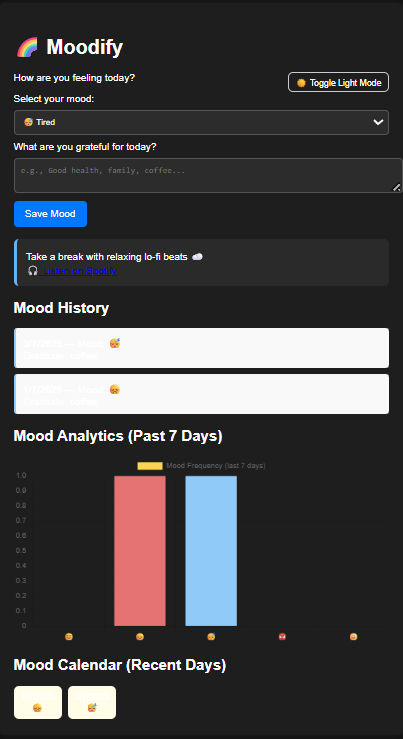

# 🌈 Moodify – Track Your Mood, Feel the Change

Moodify is a simple and beautiful mood tracker app. Track your daily emotions, express gratitude, and enjoy mood-based music recommendations.

## ✨ Features
- Emoji mood selection 😊😞😐😴😡
- Daily gratitude journaling 📝
- Music suggestions via Spotify 🎧
- Mood analytics with Chart.js 📊
- 7-day mood calendar 🗓️
- Dark mode toggle 🌙

## 🖥️ Preview

## 🚀 Live Link
[https://janhvi9101.github.io/moodify](#)

## 📁 How to Use
1. Clone or download this repo
2. Open `index.html` in your browser

---
Built with ❤️ using HTML, CSS & JavaScript

